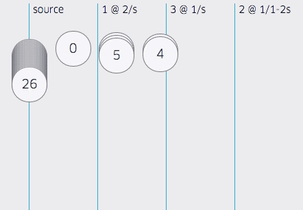
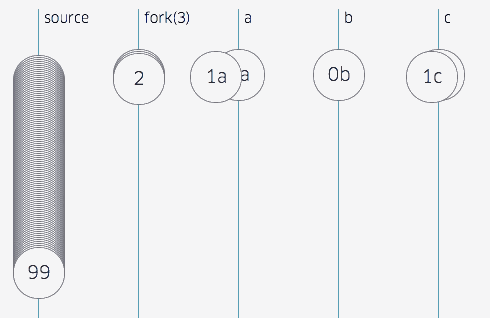
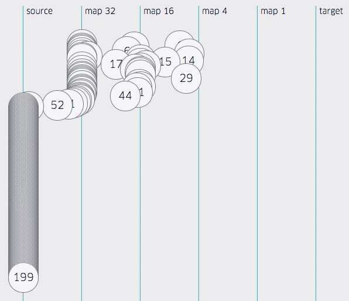
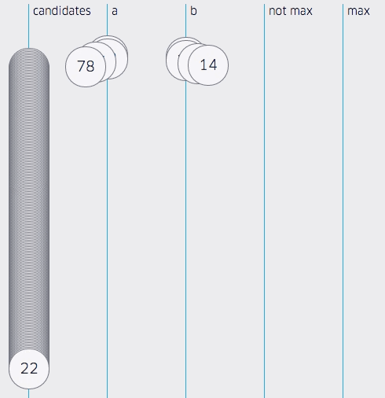
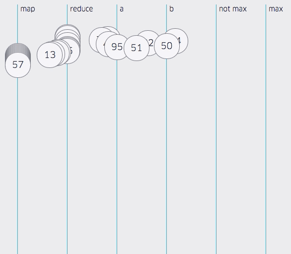

In 1905, Albert Einstein gave us a Special Theory of Relativity that unified
the concepts of space and time in a single physical model.
Einstein spent a great deal of time worrying about how one can exchange mass
and energy.
In software, we worry a lot about trading space and time.

For software, memory is laid out over space, and a process will run over the
course of time.
We divide time between asynchronous time and synchronous time.

There are many ways of describing and defining synchrony.
For the purposes of this article, a simple definition suffices.
Everything a function does before returning is synchronous.
What a function does after returning is the realm of the asynchronous.

This is the tale of two dimensions, space and time, and proposes how one can
project and triangulate a coherent design for iterators, generators, promises,
observers, and streams, particularly in JavaScript, using the primitives best
suited for each temporal or spatial use-case.


In Buddhism, there are Koans.
A Koan is a parable wrapped in a paradox.
These stories are intended to teach that "logic is the beginning of wisdom, not
the end."

There is a far famed Koan about closures and objects that emerged from a
[discussion][Qc Na] about Scheme between Guy Steele and Anton van Straaten.

[Qc Na]: http://people.csail.mit.edu/gregs/ll1-discuss-archive-html/msg03277.html

> The venerable master Qc Na was walking with his student, Anton.  Hoping to
> prompt the master into a discussion, Anton said "Master, I have heard that
> objects are a very good thing - is this true?"  Qc Na looked pityingly at
> his student and replied, "Foolish pupil - objects are merely a poor man's
> closures."
>
> Chastised, Anton took his leave from his master and returned to his cell,
> intent on studying closures.  He carefully read the entire "Lambda: The
> Ultimate..." series of papers and its cousins, and implemented a small
> Scheme interpreter with a closure-based object system.  He learned much, and
> looked forward to informing his master of his progress.
>
> On his next walk with Qc Na, Anton attempted to impress his master by
> saying "Master, I have diligently studied the matter, and now understand
> that objects are truly a poor man's closures."  Qc Na responded by hitting
> Anton with his stick, saying "When will you learn? Closures are a poor man's
> object."  At that moment, Anton became enlightened.

The walk to elightenment appears to be one of three steps.

1. What even is?
2. Oh, *everything* is!
3. Oh, some things are, some things aren't. Trade-offs.

So, it is my hope that when someone realizes that everything can be modeled
with some kind of stream, that they are in the middle of a journey, not the end,
because the epiphany that "Everything is a Stream" is just about as right as
"Everything is an Array".


It is true that you can model any value as an array.
You simply put that value in an array of length 1.
This is even useful in a variety of cases.
But, to put *everything* in an array would be silly.
There is an entire taxonomy of spatial collections suited for different uses.
Just so, there is an entire taxonomy of temporal primitives, suited for
different uses.

* singular / plural (spatial)
* sync / async (temporal)
* single consumer / multiple consumer
* unicast / broadcast
* fast producer | slow consumer

With space and time explained, there are variations on whether there can be a
plurality of consumers or producers, and whether the consumer can talk back to
the producer, either to cancel or to control flow.

Of all these dimensions, the crux for deciding which primitive to use for any
particular use-case is usually how to handle the problem of a fast producer and
a slow consumer.
Much depends on the nature of the information that the primitive models.

* push → discrete over time, observables, gauges: drop messages
* pull ← continuous over time, behaviors, counters: lose fidelity
* pressure ↔ reliable, streams

## Foreshadowing Streams

```js
return Stream.from(fileNames).map(fileName =>
    fs.readFile(fileName).then(content =>
       ({fileName, content})
}, null, 20).forEach(({fileName, content}) =>
    console.log(fileName, content.length)
);
```

All of this is leads to a coherent design for streams, in the sense of a
stream of objects with flow control to ensure that all of the objects transit
from producer to consumer in order at a sustainable pace.
This interface becomes possible by triangulating promises and iterators to make
async iterators.

# Synchronous and Singular


To explore the taxonomy of primitives, we must start at the origin, like
standing on the first of January on the cosmic calendar with our dear friends
Carl Sagan and Neil de Grasse Tyson.
The origin of space-time in software is the unit value.
A value is both synchronous and singular.
A value is not the most primitive of primitives for it breaks into the
duals of a getter and a setter.

## Getters and Setters


This concept of duality pervades all of the primitives, synchronous and
asynchronous, singular and plural.
This figure, showing the signatures of the duals of a value, is a template for
describing all of the analogous duals.

A dual is a pair of functions.
As Jafar Hussain once explained concisely to me, if you swap the argument type
and the return type of a function, you obtain its dual.
So, with a value, the getter returns a value, and the setter accepts a value.
The getter accepts nothing, and the setter returns nothing.
Thus, they are duals.

All of the duals in this article are like the getter and setter dual.
One, like the getter, is for consumers, and the other, like the setter, is for
producers.

Importantly, information flows from the producer to the consumer.
The separability of the producer and consumer, and the invariant that
information flows only from producer to consumer, is a useful primitive for the
purposes of either suggesting or enforcing the Priniciple of Least Authority.
This invariant should only be broken deliberately, when bidirectional
communication is necessary, not because conflating the duals is convenient.

# Synchronous and Plural


Extending the space dimension, we introduce plurality.
A collection is a plurality of values.

You are probably already familiar with iterators and observers as introduced in
the Gamma et al [Design Patterns][GoF].
These are two ways to lazilly push or pull a plurality of values.
These in turn break into duals.

[GoF]: https://en.wikipedia.org/wiki/Design_Patterns

- The lazy pull dual is an iterator and a generator function.
- The lazy push dual is an observer and a generator object.

These are synchronous. I leave as an exercise, why there is no dual that can
combine both push and pull, and even more significantly, why with an
asynchronous lazy collection, there can.


## Iterators


An iterator is a plural getter.
In JavaScript, an iterator is an object implementing the `next` function.
The `next` function returns iterations or throws an error.
The iteration carries a `value`, and may signal that the iterator
is `done`, that no further values will be made.

So there are three kinds of results from an iterator:

1. a value
2. a terminal value
3. a terminal exception

Significantly, if something can be terminated, it can also be concatenated.

If you are familiar with Rx, the reactive extensions libraries, Iterators are
the realm of its sister library, Ix.

## Generators


The dual of an iterator is a generator.
Instead of returning values, it accepts values.
A generator is an object that implements the methods `next`, `return`, and
`throw`.
By calling each of these methods, the producer synchronously populates some
collection, and can terminate the collection either with a value or an exception.

This dual is perhaps not as "clean" as the simple swapping of types between a
getter and a setter, but similar in spirit.

A generator is a synchronous, push-style producer, whereas iterators are
synchronous, pull-style consumers.
Because there is a mismatch between pushing and pulling, it is not possible to
connect a generator object and an iterator.

However, you can use an iterator to pull from a generator function, and you can
use a generator to push into an observer.

1. pull: iterator and generator function
2. push: generator and observer

These duals are both synchronous and lazy.
In all cases, the producer must produce before the consumer can consume.

## Generator Function and Iterator


An iterator can pull values from a generator function.
Generator functions are functions that instead of returning results, return
iterators for results.
The iterator then in turn governs the execution of the generator function.
Where a function is singular, a generator function is plural.
Generator functions are lazy and the iterators they return do not necessarily
terminate.

As a basis for understanding iterators is to examine an analogous eager
function that produces an array.
This `range` function accepts a `start` value, an exclusive `stop` value, and a
stride or `step` between the values in the result array.
It walks from start to stop by step and produces an array.

```
function range(start, stop, step) {
    var result = [];
    while (start < stop) {
        result.push(start);
        start += step;
    }
    return result;
}
assert(equals(range(0, 3, 1), [0, 1, 2]));
```

This function trades time for space. It spends time up front computing the
value and returns the result laid out in space.
A generator function trades space for time.
Instead of producing the values in space, it provides the means to produce the
values over time.

```js
function *range(start, stop, step) {
    while (start < stop) {
        yield start;
        start += step;
    }
}

var iterator = range(0, 3, 1);
assert(equals(iterator.next(), {value: 0, done: false}));
assert(equals(iterator.next(), {value: 1, done: false}));
assert(equals(iterator.next(), {value: 2, done: false}));
assert(equals(iterator.next(), {value: undefined, done: true}));
```

Each time one calls the `next` function of the iterator, the generator resumes,
initially from the beginning of the function, until it reaches a `yield`,
`return`, or `throw`, producing a corresponding iteration.
Recall that functions implicitly return undefined if they reach the end.

In this example, the range generator function produces a linear sequence of
values from start, to the stop (excluding the stop), with a step between each
value.

## Generator and Observer


The dual of a generator is an observer.
A generator can push iterations to an observer.
An observer is an object that implements `observe`, that in turn accepts
functions to handle all three of the behaviors of a generator:

1. `onNext` for observing a value
2. `onReturn` for observing termination with a value
3. `onThrow` for observing termination with an error

Observers are the realm of Functional Reactive Programming as seen in Rx and
championed by Erik Meijer.

A hybrid approach, one that combines the pulling style of iterators and the
pushing style of observers, is the realm of push-pull reactivity with behaviors
as championed by [Conal Elliott][] who coined the term Functional Reactive
Programming.

[Conal Elliott]: http://conal.net/

## To Push or to Pull

- iterators: synchronous, plural, lazy, pull, for continuous time-series
  values, FRP à la Conal Elliott.
- observers: synchronous, plural, lazy, push, for discrete time-series values,
  Reactive Programming à la Erik Meijer.

Since we are in the realm of synchronous plurals, the producer and the consumer
are locked in step.
However, it is certainly possible to asynchronously generate or iterate, by
operating on the iterator or generator over the course of separate events.
Consequently, iterators and generators can be useful for mitigating the fast
producer and slow consumer problem for time-series data.

Iterators are well-suited for continuouse time-series data.
Such data changes continuously.
It can be expected to take on a different value any time it is sampled.
Examples of time series data include time itself, or values that change over time,
like a measure of progress.
The progress value is a function of time from the time a job starts to the time
a job completes.
With continuous data, it is not practical to use an observer because the
sampling frequency is arbitrary.
With a time-series like time or progress, an iterator is appropriate because
it allows the consumer to dictate the pace, or rather, control the flow.
In an application, for example, you would sample the time or progress once
for each animation frame.
The failure mode for iterators is to sample less frequently.

Observers are well-suited for discrete time-series data.
With discrete values, the value changes abruptly in response to events.
Such time-series data can be expected to retain the same value between events.
For example, a value closely related to progress is an estimated time to completion.
This value only changes in response to improvements to information like current
network conditions or projected system load.
With observers, one can deal with a fast producer by dropping events.
Since the last event should be pretty good and the next event will be event better,
we don't need to track every value that an observer of a time-series emits.

# Asynchronous and Singular


Now, extending into the asynchronous dimension we find asynchronous singular
models.
JavaScript's asynchronous promise is one of these models, perpetrated by
Mark S. Miller, as conceived for the E programming language.
There are variations on the theme depending on the coupling between the
producer and consumer, and whether there can be multiple producers and
consumers.

## Promise and Resolver


If the result of calling a function is either a return value or a thrown error,
a deferred is an asynchronous result.
A deferred is comprised of a promise, which is an asynchronous getter, and a
resolver, which is an asynchronous setter.

```js
out = in.then(
    inval => outres,
    inerr => outres
);
```

The promise is an object that allows any number of consumers to observe either
the return value or the thrown error by registering separate functions
for these cases.
A byproduct of registering fulfillment and rejection handlers is the
construction of a new promise for the result of the applied handler.

There is a word for this design pattern.
When I present this to a group, you can find all the academics in the audience
because they are grinning like idiots, preparing their favorite perplexing ways
to explain this design pattern.
I will not pretend to understand these explanations.
This is not a burrito in space.
It is just fundamentally useful to be able to get a new promise when you plan
more work with an old promise.
You can use this promise to extend the plan.

For ergonomics, both handlers are optional.
If you do not provide a fulfillment handler, the value passes from in to out.
If you do not provide a rejection handler, an error would propagate from in to out.
Just as an exception would pass from a function you call to a function that
called you, exceptions implicitly propagate asynchronously.

## Plan Interference

Promises are designed to prevent plan interference.
Plan interference is where concurrent processes, ostensibly cooperating, manage
to prevent the other from making progress.

```js
var i = 0;
yolo(function lol() {
    i++;
});
console.log(i);
```

Take as a counter example any function you call that accepts a closure of your
own scope.
This implicitly grants the function the authority to mutate certain state in
your scope, one or more times before it returns, and one or more times after it
returns.
Using a promise library in your control, you can coerce any foreign promise to
a promise with an interface and behavior you can rely on to protect your scope
invariants.
A good promise library will ensure that either the fulfillment handler or the
rejection handler will be called never or exactly once, asynchronously.
This allows you to finalize your "plan" before returning.

## Order Independence of Promises


Promises also ensure order-independence.
Separating the producer and consumer, so that they can execute independently,
is the crux of asynchronous programming.
With a promise, you can give a promise to a consumer before giving a resolver
to a producer.
They can then produce or consume on their own schedule and the promise synchronizes.

Consider one of the early bugs with jQuery.
The jQuery top-level function registers an event handler for the
`DOMContentReady` event, ensuring that the entire document has loaded before
you run some jQuery code.
There was a time where jQuery had to be loaded synchronously, using a plain
``<script>`` tag.
It would fail to notice if it was executed after the `DOMContentReady` event
had fired.
This is a hazard that promises help us avoid.
Any number of handlers can be attached to a promise, either before or after the
resolver produces a result.

## Async Functions

Coming to a JavaScript near you are asynchronous functions,
syntax support for functions that return promises.
Where on the spatial axis we have generator functions,
on the temporal axis we have asynchronous functions.
An async function is annotated with the async keyword (like the ``*`` on a
generator function), and can use `await` (like the `yield` in a generator
function).
An async function always returns a promise and executes asynchronously,
spread across multiple events delimited on `await`.
The await keyword pauses execution until the given promise produces a result,
and then resumes either with the fulfilled value or throwing an exception at
the site of the `await`.
This allows us to use all existing JavaScript control-flow asynchronously.

```js
function time(job) {
    let start = Date.now();
    return job().then(
        () => Date.now() - start
    );
}
async function sum(getX, getY) {
   return await getX() + await getY();
}
sum(time(task), time(task)).then(console.log);
```

In fact, a promise library can use a decorator to convert a generator function
into an async function.

```js
function time(job) {
    let start = Date.now();
    return job().then(
        () => Date.now() - start
    );
}
const sum = Promise.async(function *sum(getX, getY) {
   return (yield getX()) + (yield getY());
});
sum(time(task), time(task)).then(console.log);
```

The primary difference is that the `await` keyword has significantly higher
precedence than `yield`, there is language support coming around async for
loops and the like, and having distinct async and generator functions leaves
open the door for triangulating async generator functions.

## Unicast or Broadcast

Another dimension of concern for asynchronous singular values is whether
information only flows from producer to consumer, or whether some information
can propagate back to the producer like cancellation.
For something like cancellation to work, information has to flow back up stream.
That information could then propagate downstream to any other consumers.
This would constitute another form of plan interference.
To avoid this hazard, when using promises, you need another mechanism to
explicitly grant cancellability.
Cancellation tokens are popular in the .Net universe.
Using another resolver and promise pair and passing the resolver as an argument
explicitly grants an upstream communication channel so at the very least you
know that you are setting yourself up for plan interference.

There may be an alternative to a promise that enforces a single-subscriber and
explicit forking for multiple consumers.
This "Task" type would side-step the plan interference hazard and allow cancellation
to propagate upstream based on counting references to interested tasks, or
potentially interested tasks.

## Promises in a Nutshell

A promise is an asynchronous, singular object that represents a result either
from the past or the future.

- order independence and temporal independence: a promise can be resolved
  before it is observed, or observed before it is resolved.
  The usage is the same for both cases.
- protects against plan interference and surprises by guaranteeing asynchronous
  handlers. (Zalgo, he comes not)
- unidirectional: guarantees that information flows from producer to consumer,
  protecting the Principle of Least Authority and Action at a Distance hazards.
- composable: the `then` building block is sufficient and convenient for
  orchestrating both serial and parallel jobs.
- a gateway to asynchronous proxies for remote objects.

# Asynchronous and Plural


Having now explored synchronous and plural as well as asynchronous and singular,
we can triangulate a coherent model for asynchronous and plural.
This is the realm of streams.

## Promise Queues


Working our way up from promises, there is an asynchronous collection called
a promise queue.
Results go in one side and then come out the other.
A promise queue has an asynchronous getter and an asynchronous setter, called
`put`.
These are the duals of a promise queue.
A promise queue, like a promise, ensures that information only flows from the
producer to the consumer.

## Order Independence of a Promise Queue


An asynchronous queue is like a synchronous queue.
However, unlike a synchronous queue, one can get a promise for a value before
that value has been put onto the queue.

## Temporal Independence of a Promise Queue


Also, a promise can be put onto the queue instead of a value.
Let that sink in a moment.
A promise queue only guarantees for each call to get, the returned promise is
resolved by the corresponding put in the order get and put are called.
It maintains no guarantees about the order in which those promises resolve.

Promise queues extend the notion of order independence into the plurals.

## Asynchronous Linked List

```js
function PromiseQueue() {
    var ends = Promise.defer();
    this.put = function (value) {
        var next = Promise.defer();
        ends.resolve({
            head: value,
            tail: next.promise
        });
        ends.resolve = next.resolve;
    };
    this.get = function () {
        var result = ends.promise.get("head");
        ends.promise = ends.promise.get("tail");
        return result;
    };
}
```

Though you may have to squint, a promise queue can be implemented succinctly as
an asynchronous linked list.

## Promise Queues as Iteration Transports


Promise queues can't be concatenated since the producer can't express
termination.
They also do not have a reasonable story for the fast producer and slow
consumer problem.
The queue just grows.

Promise queues can be used to transport iteration objects, familiar from
synchronous iterators.
To communicate termination, the producer puts an iteration on the queue with
its done bit set.

## Async Iterators and Generators


An asynchronous iterator is its own dual.
It is a reflexive dual.
That is, you can use one asynchronous iterator as a writer, and use its dual as
a reader.
The writer will send values from the producer to the consumer, and the reader
will send acknowledgements (iterations carrying a null value) back to the
producer.
They use the same interface, using `next` both to send a value and receive a
promise for the next iteration.

## Streams


Unlike a synchronous iterator, the `next` method returns a promise for an iteration,
straight out of a promise queue.
The `next` method also creates an iteration, carrying a value back to the
producer in another promise queue.
The `return` method produces a done iteration and the `throw` method puts a
rejected promise onto the queue.

Asynchronous iterators can both push and pull.
They maintain the same speed, the slower of the producer and consumer,
by waiting for the promise `next` returns before calling `next` again.
A buffer can be constructed by priming the return queue with a bunch of null
iterations, determining the maximum number of concurrent iterations in flight.

Unlike a promise, a stream is a bidirectional communication channel,
for both the purposes of flow control and cancellation.
Either end of a stream can terminate the stream by throwing.

## General Theory of Reactivity


That is A General Theory of Reactivity.
We can triangulate streams by combining the design of iterators and promises.
We can create async generator functions that combine yield and await to produce
an async iterator, distinguishing the use of await for asynchroneity from the
use of yield for iteration.
As with iterators, we can implement a suite of operators that compose async
iterators, like `map`, `reduce`, and `forEach`.

# Epilogue: Compelling Animations

This brings us to our exciting conclusion.
The following animations are recordings of browser-based demos orchestrated
from a prototype implementation of asynchronous iterators in the [GToR][]
repository.

[GToR]: https://github.com/kriskowal/gtor

## Sharing Streams



In this illustration, three consumers share an asynchronous iterator.
The producer keeps a buffer full of numbers and terminates after producing 100
values.
The consumers take values off the iterator in turns.
This system distributes work to the consumers according to their own pace.
The fastest consumer receives the most values.
The iteration is consumed at a pace that is the sum of the paces of the
consumers.

## Forking Streams



In this illustration, all of the consumers need to see all of the values from
the producer.
Consequently, the pace of the producer is limited by the slowest consumer.
None of the consumers stray far from being in sync.

## Mappings over Streams

A synchronous map function returns an array.
A lazy synchronous map function returns an iterator.
An asynchronous map function returns an asynchronous iterator.
Consequently, maps can be chained.
The async map function also accepts a concurrency limit as another optional
argument.
Since the relation you give the mapping can be asynchronous, it can return a
promise.
The concurrency limit dictates how many of these outstanding promises the map
function will permit.



This illustration shows a chain of map functions, each tapering down its
concurrency limit.
Eventually, the pace of the pipeline is constrained by the bottleneck at the
end.

## Reducing Streams

A synchronous reduce function returns a single value.
An asynchronous reducer accepts an asynchronous accretion function and returns
a promise for the final value.
Like our asynchronous map, the asynchronous reducer retains a concurrency limit.
It also keeps a pool of glommed values around and opportunistically reduces
values from the buffer and the input until only one remains.



This is an illustration of a reducer attempting to find the highest value
from the producer.
It does so by comparing each pair of values, discarding the lesser, and
returning the greater to the internal pool.
When the pool has fewer values laying around than the concurrency limit, it
will obtain more from the input.
Finally, it finds the highest value and resolves the returned promise.

## Mapping and Reducing Streams



And of course, mapping and reducing can be combined.

# A General Theory of Reactivity

In summary, we can define a host of primitives suitable for composition across
the dimensions of space and time.
Each of these primitives is a dual, one for producers and one for consumers.
Each of these primitives is well-suited for a particular strategy for dealing with
the fast producer and slow consumer problem.
There is a tension between robust composition and bidirectional communication.
In short, there cannot just be one model to rule them all, but a palette of
coherent primitives suitable for composition.

